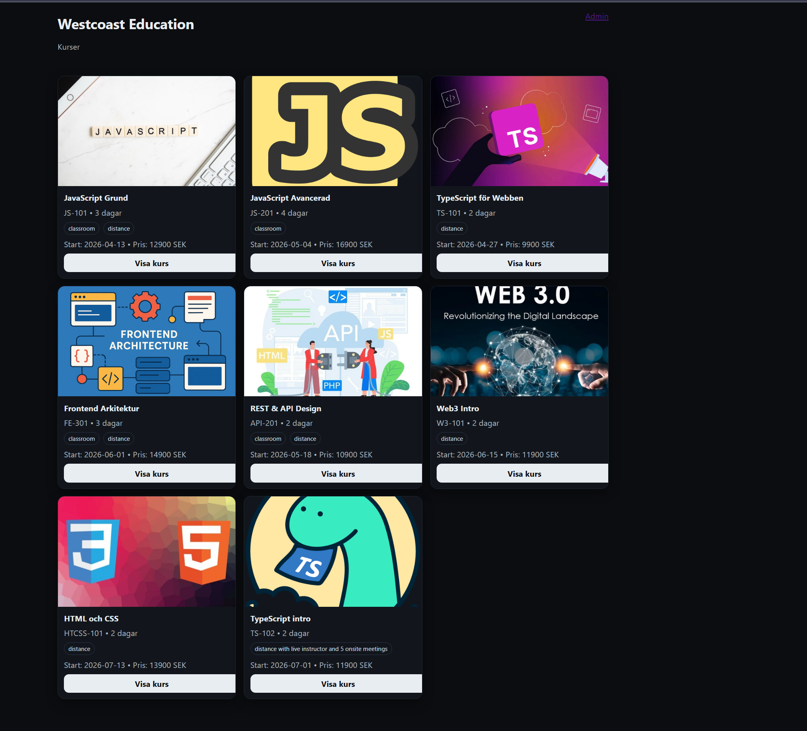

# Westcoast Education

---

[](https://skillicons.dev)

---


---

## Meny

- [Funktionalitet](#funktionalitet)
- [Teknik](#teknik)
- [Kör projektet](#kör-projektet-viktigt-stå-i-westcoast)
- [Demo credentials](#demo-credentials)
- [VG-spår: TypeScript + TDD](#vg-spår-typescript--tdd-synligt-för-läraren)
- [Kvalitetscheck](#kvalitetscheck-sluttest)
- [Vanliga endpoints](#vanliga-endpoints-api)

---

## Screenshot



---

En frontend-app för att visa och boka kurser för **Westcoast education**, med ett adminflöde för att skapa nya kurser.
Projektet använder `json-server` som REST-API och en statisk frontend i HTML/CSS/JS.

---

## Funktionalitet

### Steg 1, Visa kurser

- Startsidan listar kurser (bilder, titel, kursnummer, startdatum, pris).
- Detaljsida visar information om vald kurs.

### Steg 2, Bokning + konto

- Bokningssida nås via `book.html?courseId=<id>`.
- Skapa konto / logga in.
- Genomför bokning (sparas i API:t).

### Admin

- Admin kan skapa nya kurser.
- Nya kurser får alltid:
  - standardbild: `./assets/images/newcource.png`
  - startdatum: dagens datum (YYYY-MM-DD)
  - standard-genomförande: `distance`
- UI har fallback så inga trasiga bilder och inga `undefined` visas.

---

## Teknik

- Frontend: **HTML**, **CSS**, **JavaScript (ES Modules)**
- TS/VG-spår: **TypeScript** (validering + tester)
- API: **json-server**
- Tester: **Vitest**

---

## Kör projektet (viktigt: stå i `westcoast\`) annars får du error.

### 1) Installera beroenden enligt instruktionen

**Kör i mappen:**

`H:\<mappnamn>\<mapp>\<mapp>\<mapp>\westcoast_edu\westcoast`

```bash eller powershell7
npm install
```

---

### 2) Starta API

- **npm run api**

---

## API kör på

    - [API](http://localhost:3001)

---

### 3) Starta frontend

- Öppna filerna i webbläsare\*\* (via Live Server i VS Code eller direkt i browsern):
- kör **client/index.html**

### 4) Kör tester och TS-check

- npm test
- npm run ts:check

## övrigt

- Demo credentials --> E-post: demo@westcoast.se and Lösenord: demo123

---

- Inga console errors
- Inga trasiga bilder (fallback finns)
- Navigation fungerar (Start/Admin)
- Admin-create skapar kurser med komplett data
- Booking-flöde fungerar: skapa konto → logga in → boka → logga ut
